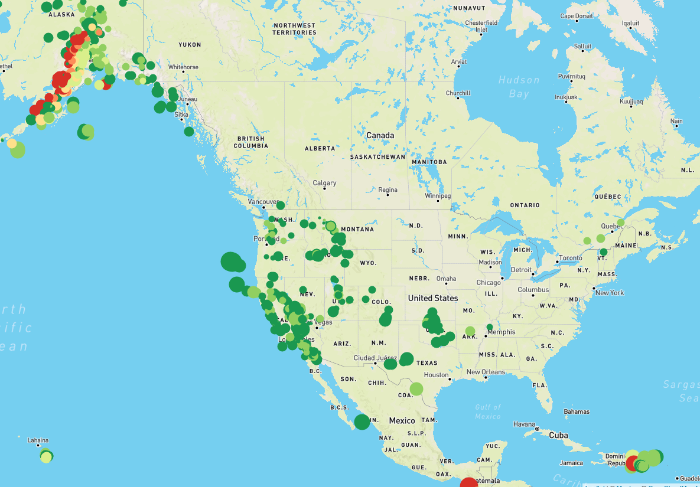
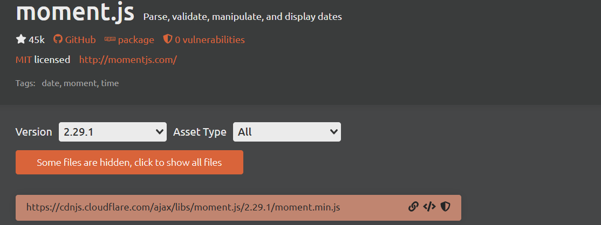
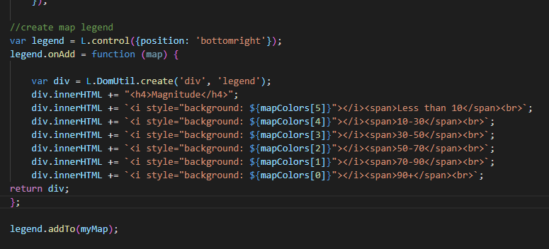

# leaflet-challenge

To think the hardest part of this assignment for me was figuring out that I needed to make a small adjustment to the css file downloaded from gitlab...

I learned so much from this challenge. My understanding of js, js libraries, and html/css has grown tremendously.
I finished a large portion of this assignment before I ever got live-server to show me a map. Once I finally figured out my css file contained the wrong div label I quickly managed to get the basic map and earthquake markers in place. Having done so much work before I could see the map, I already knew how I was going to add popups but the colors and sizes of the markers was a bit of a challenge. I spent quite a long time reviewing leaflet documentation before I finally managed to make progress with the colors, only to quickly a more efficient solution within minutes of creating my own. 

Here's what the map looked like at that point:

As I was adding popup info I realized the 'time' property from the json file was a unix timestamp and I spent some time figuring out how to turn it into something clean and meaningful. I found moment.js and learned how to add it into the html to get it to easily transform the timestamps into HH:mm:ss.

I was pretty satisfied with how I handled this issue, even it was an extremely small piece of the assignment.

Finally the legend...
By this time I already knew I needed to make some adjustments to the css to make a space for the legend, but it was still a bit tricky getting everything right. I definitely struggled with the L.DomUtil.create() function as well as the div.innerHTML statements, but I actually feel like I understand all the pieces of the code now which is very rewarding.

Code for the map legend:

